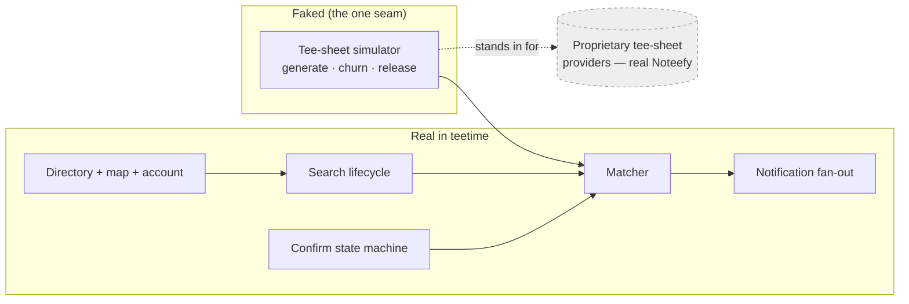
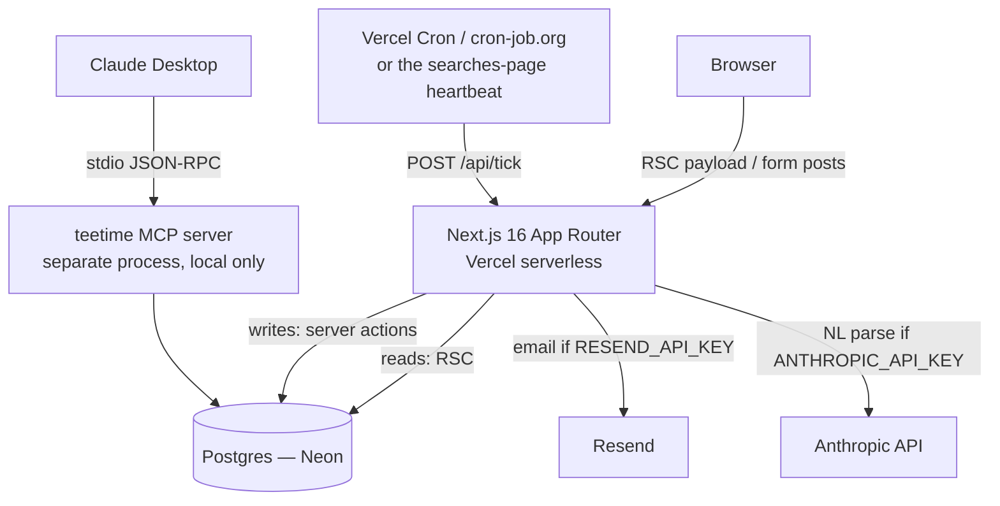
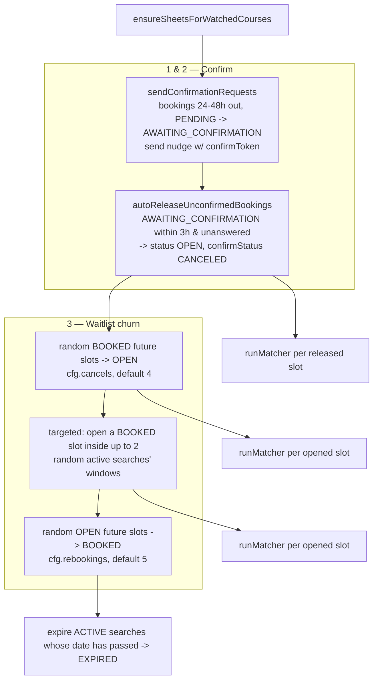
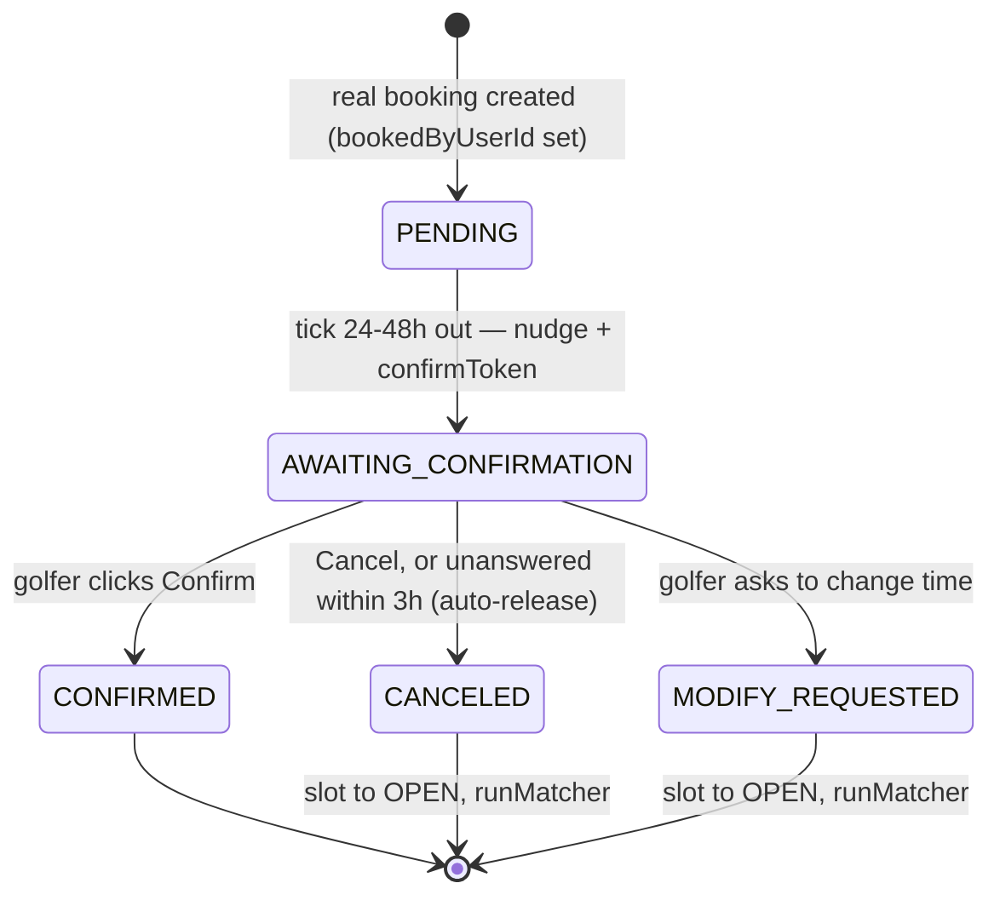
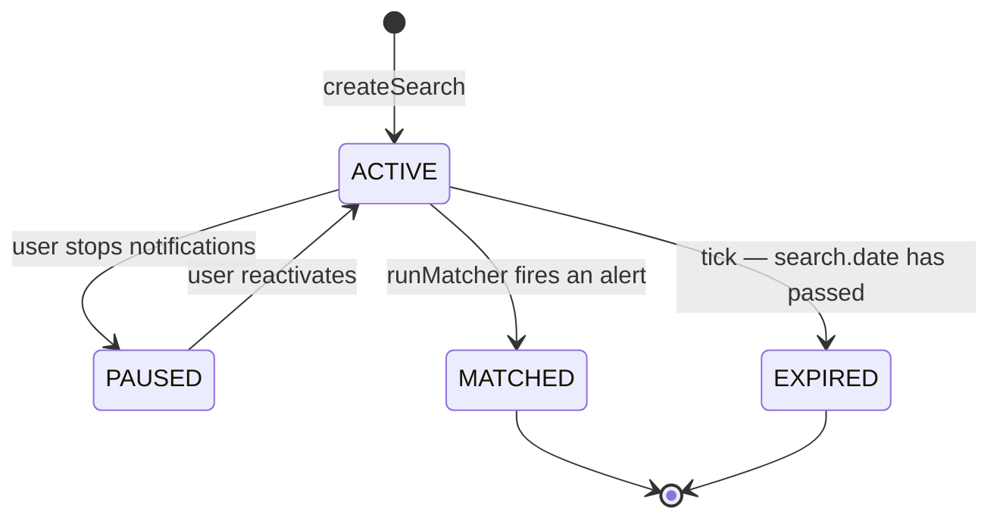
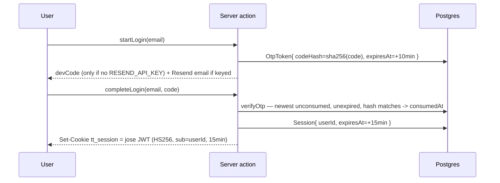
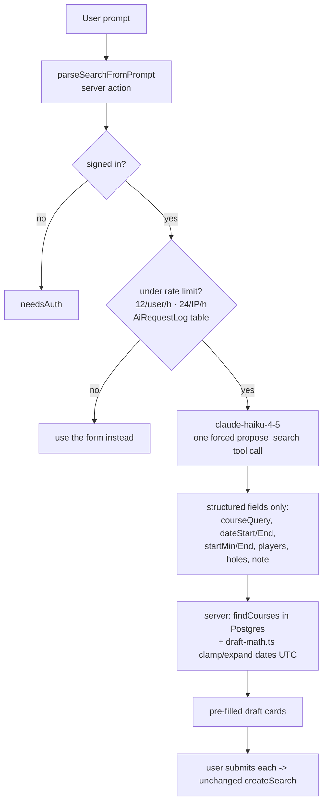
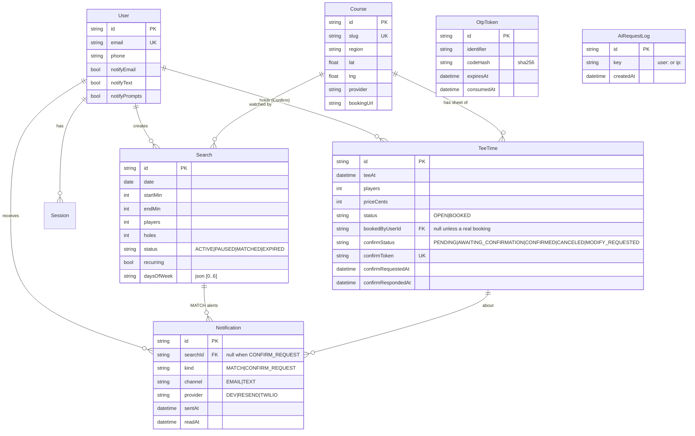

# teetime — full project briefing

A working recreation of the **Noteefy** golfer app, built as a challenge after the
Noteefy founder challenged Aden to rebuild the product with AI. Same product shape,
same visual language, new name (`teetime`) and logo (a bell whose handle is a golf
flagstick).

This document is the deep version of [`ARCHITECTURE.md`](./ARCHITECTURE.md) — written
so it can be read cold, discussed line-by-line with Noteefy's CTO, and handed to an
assistant for diagramming. Every claim points at a file you can open.

- **Live:** <https://teetime-ten.vercel.app>
- **Repo root:** `C:\Users\adena\Documents\Aden's Work\teetime`
- **Stack:** Next.js 16 (App Router) · React 19 · Prisma 6 · Postgres (Neon) · Leaflet + OSM · Tailwind v4 · `jose`
- **Deploy:** Vercel + Neon, push-to-`main` auto-deploys

---

## 1. The one big idea

> **The hard, valuable part of Noteefy is live integrations with proprietary
> tee-sheet software. That can't be recreated. So teetime fakes *only* that one
> piece — a simulated tee-sheet provider — and builds everything downstream as
> real, observable code.**

Everything a reviewer would want to poke at — the matcher, the notification
fan-out, the Confirm state machine, the search lifecycle, the account area, the
map — is genuine. The simulator is the seam where "we'd call GolfNow / foreUp /
Lightspeed here" is replaced by "we generate and churn a plausible tee sheet."



---

## 2. What Noteefy is (working understanding — confirm with the CTO)

Noteefy sells software to **golf courses** and a companion experience to
**golfers**. From researching the public product, it runs at least two mechanics:

| Product | Who starts it | What it does | teetime status |
|---|---|---|---|
| **Confirm** | The course | 24–48 h before each booked round, message the golfer to **confirm / cancel / modify**. Cancels and no-responses free the slot early enough to resell. Targets revenue lost to no-shows and late cancellations. | **Primary** mechanic recreated |
| **Waitlist** (a.k.a. tee-time search / "timesearch") | The golfer | Golfer registers a want — course + date + time window + party size. When a matching slot opens, they get an email/SMS with a booking link. | **Secondary**, retained — it's also what *refills* a slot Confirm frees |

Supporting surface recreated: a ~1,000-course **directory + map**, **account /
profile**, **notification preferences**, **My Searches** list, passwordless
(OTP) auth. Visual cues that shaped choices: Noteefy's map is a Google *My Maps*
iframe (`©2026 Google` attribution); the account screens are Material UI (blue
`EDIT` button, notched-outline fields, light-blue `ALL SEARCHES` tab); brand
colour is crimson.

**Revenue logic to be able to discuss:** a no-show or unresold late cancellation
is ~100% lost margin on that slot. Confirm's value is *time* — surfacing the gap
early enough (hours, not minutes) that Waitlist demand can refill it at full or
near-full price. teetime models exactly this chain end to end.

---

## 3. What's real vs. faked vs. simplified

| Area | Real | Faked / simplified |
|---|---|---|
| Tee-sheet supply | — | **Simulated** (`src/lib/simulator/engine.ts`) |
| Matching | ✅ `runMatcher` — real predicate over real rows | — |
| Confirm flow | ✅ full state machine, token links, auto-release | Fixed 3 h cutoff; token never expires; "modify" = release + go make a search |
| Notifications | ✅ fan-out, per-channel rows, Resend email if keyed | SMS recorded but **not delivered** (no Twilio) |
| Auth | ✅ OTP request/verify, `jose` JWT, `Session` rows | OTP code shown on screen when no email provider; `Session` row written but not yet re-checked on read |
| Map | ✅ Leaflet, hybrid rendering, geolocate, click-to-activate | Tiles are OSM, not Google |
| Course coords | ✅ 503 geocoded exactly (OSM Nominatim) | ~350 placed by state centroid + jitter; a few land in water |
| Time zones | ✅ all math is UTC and process-independent | No real per-course local time |
| Booking | — | teetime never actually books anything; alert links point at a placeholder URL |

---

## 4. System architecture

### 4.1 One deployable



- **Reads** are React Server Components hitting Prisma directly (`export const
  dynamic = "force-dynamic"` on data pages). No REST/GraphQL layer.
- **Writes** are server actions (`"use server"` files under `src/lib/*/actions.ts`).
- **The only route handler** is `/api/tick` — the simulator crank (+ a GET status
  peek). That *is* the "mock API" boundary.
- **The MCP server** (`src/mcp/server.ts`) is a completely separate entrypoint,
  not part of the web deploy.

### 4.2 Request lifecycle examples

**Creating a search** (`src/lib/searches/actions.ts` → `createSearch`):
1. `getCurrentUser()` — 401-ish `{ needsAuth: true }` if not signed in.
2. `zod` parse the form; reject if `endMin <= startMin`.
3. `db.search.create(...)` with `status: ACTIVE`.
4. `ensureSheetsAround(db, course, day, 1)` — lazily generate that course's tee
   sheet for day ± 1 so the simulator has something to open.
5. `revalidatePath("/searches")`.

**A slot opening** (`src/lib/simulator/engine.ts` → `tick` → `runMatcher`): see §5.

### 4.3 Key libraries and why

| Choice | Why |
|---|---|
| Next.js 16 App Router | One deployable; RSC removes a client-fetch layer; server actions remove an API layer |
| Prisma 6 (not 7) | `create-next-app` pulled Prisma 7 (driver adapters + config file + query compiler) — friction on greenfield; downgraded to the well-trodden 6 |
| Postgres on Neon free tier | One hosted DB for local dev *and* prod; schema still runs on SQLite (enums = validated strings, `daysOfWeek` = JSON string) by flipping `provider` |
| Leaflet + OSM | Keyless. Google Maps JS API needs a billed key; Noteefy sidesteps this with an iframe, we sidestep it with Leaflet and rebuild the interaction |
| `jose` | Tiny, standard JWT sign/verify; no NextAuth/Clerk dependency for a passwordless flow we want to own |
| Tailwind v4 | Matches Noteefy's look at ~0 bundle cost; hand-built the few MUI-looking account components |

---

## 5. The simulator (`src/lib/simulator/engine.ts`)

### 5.1 Tee-sheet generation — `ensureSheet`

- **Grid:** every 10 min from 06:00 to 18:00 UTC = **73 slots/day** (`SLOT_INTERVAL_MIN`, `DAY_START_MIN`, `DAY_END_MIN` in `time.ts`).
- **Deterministic:** each slot's open/booked state, party size and the course's
  price base come from `seededUnit(seed)` (FNV-1a + xorshift hash of a string —
  `src/lib/rand.ts`). Same course + same instant ⇒ same sheet every run. No
  `Math.random()` in generation.
- **Price curve** (`priceForMinute`): base `$45–$135` (from course slug) ×
  `1.15` dawn / `1.25` prime morning / `1.0` midday / `0.7` twilight.
- **Open bias:** `min(0.55, 0.12 + daysOut * 0.03)` — near days are busy (~12%
  open), further-out days looser (up to 55% open).
- **Idempotent:** `createMany` on the `@@unique([courseId, teeAt])` constraint.

### 5.2 Lazy vs. full generation

Full generation would be **~1,000 courses × 73 slots × 14 days ≈ 1.02 M rows**.
The Neon free tier is small, so sheets are generated **only for courses with an
upcoming `ACTIVE`/`MATCHED` search**, day ± 1 (`ensureSheetsAround`,
`ensureSheetsForWatchedCourses`, called on search creation and at the top of
every tick). `FULL_SHEETS=1 npm run db:seed` pre-generates everything for local
dev.

### 5.3 The churn tick — `tick(db, { cancels, rebookings })`

Cranked by `POST /api/tick`. Order matters:



- Cancellations, targeted cancellations and Confirm auto-releases **all funnel
  into the same `runMatcher`** — the matcher doesn't care what freed the slot.
- The **targeted cancellation** is the demo-realism hack: each tick it tries to
  open a slot *inside a random active search's window* so demos reliably produce
  hits. Real Noteefy just waits for a real slot to free up.
- `pickRandom` and the "someone else grabbed it" rebookings are the only
  non-deterministic parts — deliberately, so repeated ticks evolve the world.

### 5.4 The matcher — `runMatcher(db, teeTime)`

The match predicate (one SQL query):

```
Search.courseId == teeTime.courseId
Search.status   == ACTIVE
Search.date     == teeTime's UTC day
Search.startMin <= minutesFromMidnight(teeTime.teeAt) <= Search.endMin
Search.players  <= teeTime.players
```

Then per matched search: dedupe on `(searchId, teeTimeId)` (never alert twice for
the same slot), `sendAlert(...)`, and flip the search to `MATCHED`.

**Discussion point:** `holes` is stored on both sides but not currently in the
predicate (sheets are all 18-hole). `recurring`/`daysOfWeek` are stored but the
matcher only looks at the single `date` — recurrence is modelled, not yet
executed. Both are deliberate scope cuts, easy to close.

---

## 6. Confirm flow

### 6.1 State machine (`confirmStatus` on `TeeTime`)



- Timing constants (`src/lib/constants.ts`): `CONFIRM_ASK_MIN_HOURS = 24`,
  `CONFIRM_ASK_MAX_HOURS = 48`, `CONFIRM_AUTO_RELEASE_WITHIN_HOURS = 3`.
- The golfer link is `/confirm/[token]` — **token-gated, not auth-gated** (like
  clicking a link in an email). Actions in `src/lib/confirm/actions.ts`.
- `CANCELED`, `MODIFY_REQUESTED`, and auto-release all set `status: OPEN` and call
  `runMatcher` — the freed slot immediately feeds Waitlist.
- **Modelling choice:** booking ownership is fields *on `TeeTime`*
  (`bookedByUserId`, `confirmStatus`, `confirmToken`, `confirmRequestedAt`,
  `confirmRespondedAt`) rather than a separate `Booking` table. A slot only ever
  has one holder; this kept the diff small and reviewable. Trade: no booking
  history, no multi-slot bookings.

### 6.2 How a demo booking gets created

`scripts/seed.ts` attaches one `BOOKED` slot ~26–46 h out to the demo user
(`bookedByUserId`, `confirmStatus: PENDING`), so the next tick sends a real
confirmation nudge you can click through.

---

## 7. Waitlist flow



- `Search` = `userId + courseId + date + startMin + endMin + players + holes`,
  optional `recurring` + `daysOfWeek` (JSON `[0..6]`).
- Created from the map/directory `CreateSearchDialog` **or** the natural-language
  popup (§10). Both post to the same `createSearch`.
- After `MATCHED`, the search stops matching (single-shot). Re-arming would be a
  small change (`MATCHED → ACTIVE` on a timer, or don't transition at all for
  recurring searches).

---

## 8. Notifications (`src/lib/notify/index.ts`)

- Two builders: `sendAlert` (Waitlist "slot opened", `kind: MATCH`, has
  `searchId`) and `sendConfirmationRequest` (Confirm pre-round nudge,
  `kind: CONFIRM_REQUEST`, `searchId: null`).
- **Fan-out:** one `Notification` row per enabled channel (`notifyEmail`,
  `notifyText` + phone present). Always writes at least one row ("leave a trace").
- **Delivery:** `deliverEmail` posts to Resend if `RESEND_API_KEY` is set, else
  returns `"DEV"`. SMS always `"DEV"` (stubbed). Provider recorded per row.
- **Dev Outbox:** `/dev/outbox` renders every `Notification`; "Run simulator
  once" button triggers a tick. Alerts also render inline on the search card.

---

## 9. Auth (`src/lib/auth/`)



- Cookie: `httpOnly`, `sameSite=lax`, `secure` in prod, `maxAge` 15 min
  (`MAX_AGE` in `session.ts`).
- `enterDemo()` — one-click, no OTP, shared `demo@teetime.app` account. This is
  what makes the public deploy reachable by anyone (relevant to §10's rate limit).
- **Known gap to be honest about:** `getUserId()` only verifies the JWT — it does
  **not** re-check the `Session` row, so "sessions can be revoked" is aspirational
  until that lookup is added. Rows are being written; the read path just ignores
  them.

---

## 10. AI features

### 10.1 MCP server (`src/mcp/server.ts`) — `npm run mcp`

Read-only [Model Context Protocol](https://modelcontextprotocol.io) server over
stdio. Separate process; not deployed. Three tools, each a thin wrapper over the
same Prisma models the app uses:

| Tool | Input | Returns |
|---|---|---|
| `search_courses` | `query` | ≤25 `Course` rows incl. `id` |
| `check_availability` | `courseId`, `date` | OPEN `TeeTime` slots that UTC day |
| `get_search_status` | `searchId` | search status + every alert sent for it |

**Tradeoff — read-only first pass:** writes (create a search, cancel via confirm
token) were left out because an MCP client can invoke tools autonomously and each
write has a real side effect. A read-only surface still answers "is anything open
at Chambers Bay Saturday?" with no way to mutate state.

**Windows/Claude Desktop gotcha:** the desktop app spawns MCP servers in
`system32` and ignores the config `cwd`, and can't spawn `npm` directly — so the
config points at `scripts/mcp.cmd`, which `cd`s to the repo via `%~dp0` and needs
only `node` on `PATH`.

### 10.2 Natural-language search (`src/lib/ai/`) — optional, gated on `ANTHROPIC_API_KEY`

Bottom-right floating popup (`NlSearchWidget`, rendered site-wide from the `(app)`
layout). Flow:



**The design principle:** the model does *only* fuzzy-text → structure. Course
lookup, date math, the app's limits, and the actual write all stay in
deterministic code — so the AI path **cannot create a search the manual form
couldn't**, and a model hiccup degrades to "use the form." `draft-math.ts` is
pure (no SDK, no `server-only`) precisely so date logic is unit-checkable — this
app has been bitten by date bugs before (§11).

---

## 11. Time / UTC discipline (`src/lib/time.ts`) — the war story

**The incident:** day/time-of-day math originally used the running process's
local timezone (`setHours`, `getHours`). Tee sheets seeded from a laptop in
US-Pacific, matched by a Vercel function in UTC → a ~7 h skew → the matcher
silently stopped finding hits past a certain date.

**The fix:** every helper now uses explicit UTC (`setUTCHours`, `getUTCHours`,
`sameUtcDay`, …). "Midnight" and "minutes from midnight" are the same instant on
any machine in any timezone. Email copy that prints a date passes
`timeZone: "UTC"` to match.

**Still simplified:** there's no real per-course local time — a 7 am slot is 7 am
UTC everywhere. That's a known demo simplification. The bug was *local-time-per-
process*; *UTC-for-everyone* is a deliberate, consistent choice.

---

## 12. The map (`src/components/course-map*.tsx`)

- **Hybrid rendering** for ~1,000 points without 1,000 DOM nodes:
  - zoom < 6: every course as a canvas dot on one shared `L.canvas()` renderer
  - zoom ≥ 6: only courses in the current viewport, as `divIcon` bell pins,
    capped at 250, recomputed on `moveend`/`zoomend`
  - No clustering — the real map doesn't cluster.
- **Click-to-activate scroll zoom** ("cooperative gesture handling") — scroll
  over the map scrolls the *page* until you click into the map; moving the cursor
  off re-disarms. This matches what Google Maps embeds do by default (and what
  Noteefy's iframe therefore does). Earlier attempts — always-on scroll-zoom
  (traps page scroll under the header) and ctrl+scroll (zooms the page in some
  browsers) — are documented in `ARCHITECTURE.md` row 16.
- **Stacking contexts:** Leaflet panes/controls go up to z-index ~1000 and bled
  over the header. Fix: header at `z-1200`, map wrapped in `isolate z-0`. The
  `CreateSearchDialog` then had to be `createPortal`'d to `<body>` at `z-[2000]`
  to escape that `isolate` context. The NL popup sits at `z-[1300]` and
  deliberately doesn't use a portal/modal at all.

---

## 13. Data model (`prisma/schema.prisma`)



- `TeeTime` has `@@unique([courseId, teeAt])` (idempotent sheet generation) and
  indexes on `confirmStatus`.
- Enums are validated strings; the one list (`daysOfWeek`) is a JSON string — so
  the schema runs unchanged on SQLite.
- Constants for every enum: `src/lib/constants.ts`.

---

## 14. Deployment

- **Vercel** (Next host) + **Neon** (Postgres). `git push origin main` →
  auto-deploy. `npm run build` = `prisma generate && next build`.
- One Neon project serves **both** local dev and prod (small data footprint
  thanks to lazy sheets). `DATABASE_URL` (pooled) + `DIRECT_URL` (direct, for
  `prisma db push`).
- **Keeping the simulator alive in prod:** a client heartbeat
  (`SimulatorHeartbeat`, on the searches page, `POST /api/tick` every 20 s while
  the tab is visible, max 30 ticks) — backed up by an optional external cron
  (`cron-job.org` / GitHub Actions) hitting `/api/tick?run` with `CRON_SECRET`.
- Env vars: `DATABASE_URL`, `DIRECT_URL`, `AUTH_SECRET` (required);
  `RESEND_API_KEY` + `EMAIL_FROM`, `ANTHROPIC_API_KEY`, `CRON_SECRET`,
  `SIM_TICK_*` (optional). Full walkthrough: [`DEPLOY.md`](./DEPLOY.md).

---

## 15. Decisions & tradeoffs (expanded)

The canonical table is `ARCHITECTURE.md` §4 (rows 1–18). The ones most worth
defending to a CTO:

1. **Simulate the supply side (row 1).** Not a shortcut — it's the only way to
   make the *rest* real and inspectable. The seam is honest and narrow: one
   module, clearly labelled.
2. **Confirm as the primary mechanic (row 17).** The first build was pure
   Waitlist. Researching the product line, the machinery already built (course
   tee sheet, cancellations freeing slots, alerts on the *transition*) *is*
   Confirm. Confirm is course-initiated + booking-attached; Waitlist is
   golfer-initiated + search-attached; they share the matcher.
3. **Booking ownership as fields on `TeeTime`, not a `Booking` table (row 17).**
   A slot has exactly one holder; smaller reviewable diff. Cost: no history, no
   multi-slot bookings.
4. **RSC + server actions, no API layer (row 11).** The only HTTP endpoint is the
   simulator crank. Fewer moving parts; the "mock API" really is just the seam.
5. **Lazy tee-sheet generation (row 2 / §5.2).** 1 M potential rows → only what's
   watched. Keeps a free Postgres tier viable; the cost is `check_availability`
   returns nothing for unwatched courses.
6. **Postgres that also runs on SQLite (row 7).** Enums-as-strings, list-as-JSON.
   Portability kept for ~free.
7. **AI is parse-only, rate-limited (rows 18 / §10.2).** The model can't do
   anything the manual form can't. Writes (booking, cancelling) are a separate
   human-in-the-loop question, deliberately deferred.
8. **Keyless map, interaction rebuilt (rows 3–6).** Matches Noteefy's UX without
   Noteefy's Google bill; the hybrid canvas/pin renderer is the interesting part.

---

## 16. Known limitations / what I'd do next

**Limitations (also `ARCHITECTURE.md` §6):**
- Create-a-search modal was reconstructed (no reference shot existed).
- Big-state directory pages render every course (California ≈ 200 rows), no
  pagination.
- ~350 courses on state-centroid coords; a few land in water.
- SMS recorded, not delivered.
- Confirm is scoped: fixed 3 h cutoff, non-configurable reminder timing,
  `confirmToken` never expires, "modify" = release + make a search.
- No per-course timezone (all UTC).
- `Session` rows written but not consulted on read (no true revocation yet).
- `holes` and `recurring`/`daysOfWeek` stored but not in the match predicate.

**Next steps, roughly in order:**
1. Honour `recurring`/`daysOfWeek` in the matcher; re-arm matched recurring searches.
2. Check the `Session` row on read → real logout-everywhere / revocation.
3. Course-local timezones (store IANA zone on `Course`, convert at the edges).
4. Real "modify" — propose alternative slots from the same sheet.
5. Configurable Confirm timing per course; `confirmToken` expiry.
6. MCP write tools behind per-call confirmation.
7. Directory pagination / virualization for large states.
8. SMS via Twilio (needs a paid number + A2P).

---

## 17. Anticipated CTO questions — and answers

**"Why simulate instead of integrating one real provider (e.g. GolfNow)?"**
Time-box and access. The valuable IP is the *breadth* of integrations and the
normalization layer across them; a single integration wouldn't prove the product
and I don't have partner credentials. The simulator is a clearly-marked seam —
everything it feeds is real. If you gave me a sandbox I'd swap the module.

**"How is your matcher different from a cron that scans everything?"**
It's event-driven off the *transition*: `runMatcher` runs when a specific slot
goes `OPEN` (cancel, targeted cancel, Confirm auto-release, or golfer cancel),
and only queries searches for *that* course/day/window. It's not a full-table
sweep. Dedup is on `(searchId, teeTimeId)`.

**"What stops a golfer being spammed?"**
A search is single-shot — it transitions to `MATCHED` on the first hit and stops
matching. Per-slot dedup prevents re-alerting for the same slot. Channels are
per-user opt-in. (Re-arming for recurring searches is a deliberate TODO.)

**"Confirm — what's the release timing and why?"**
Ask window 24–48 h out (enough time to resell, not so early the golfer forgets);
hard auto-release at 3 h before tee-off if still unanswered. Both are constants,
currently global — per-course config is the obvious next step.

**"Why fields on `TeeTime` instead of a `Booking` entity?"**
A slot has one holder and I wanted a small, reviewable diff. It costs booking
history and multi-slot bookings. For production I'd promote it to a `Booking`
table once those matter.

**"Data volume / cost?"**
~1,000 courses. Full sheets would be ~1 M `TeeTime` rows for 14 days; lazy
generation keeps it to watched courses only, so the free Neon tier is fine.
Reads are RSC-direct, no caching layer yet.

**"Timezones?"**
Everything is UTC and process-independent after an early bug where local server
time skewed matching. Real per-course local time is not done — I'd store an IANA
zone on `Course` and convert only at input parsing and display.

**"The AI features — are they gimmicks?"**
The MCP server is a real, typed, read-only interface to the same models the app
uses — useful for "what's open at X?" from an assistant. The NL search is
strictly a parser in front of the existing form; it can't create anything the
form can't, it's rate-limited, and it's off unless a key is set. Neither can
mutate state autonomously — that was the line I didn't want to cross without
human-in-the-loop.

**"What would break first under real load?"**
The per-tick `findMany` + loop pattern in the simulator (fine at demo scale,
not batched), the lack of read caching on directory pages, and the client
heartbeat as a cron substitute. All known, none load-bearing for the demo.

---

## 18. File map

```
src/
  app/
    (app)/            find · searches · account/{profile,notifications,settings} · dev/outbox
                      faq · support · accessibility · legal/*        (shared header/footer + NL popup)
    (auth)/           login · verify · signup · confirm/[token]      (full-bleed)
    api/tick/route.ts the simulator crank (POST) + status (GET)
  lib/
    simulator/engine.ts   sheet gen · tick · runMatcher · Confirm nudges + auto-release
    confirm/actions.ts    golfer confirm / cancel / modify (token-gated)
    searches/actions.ts   createSearch · pause · delete · reactivate · parseSearchFromPrompt
    notify/index.ts       sendAlert (MATCH) · sendConfirmationRequest (CONFIRM_REQUEST)
    auth/                 otp.ts (request/verify) · session.ts (jose JWT) · actions.ts
    ai/                   parse-search.ts (LLM) · draft-math.ts (pure UTC) · rate-limit.ts
    account/actions.ts    profile · prefs · delete
    time.ts               UTC-everywhere day/minute helpers
    rand.ts               seededUnit — deterministic hash PRNG
    constants.ts          every enum + Confirm timing + booking providers + brand
    courses.ts            getCourses · groupByRegion · findCourses
    db.ts                 Prisma singleton
  components/
    course-map*.tsx       Leaflet hybrid renderer + detail panel
    create-search-dialog.tsx   portalled modal (map stacking-context escape)
    nl-search-widget.tsx  bottom-right NL popup (NlSearchWidget + NlSearchPanel + DraftCard)
    simulator-heartbeat.tsx    client-side tick pump on /searches
    header-shell.client.tsx    hide-on-scroll header
    account-shell.tsx, profile-form.tsx, notification-prefs.tsx  MUI-look, hand-built
  mcp/server.ts          read-only MCP tools over stdio (npm run mcp)
scripts/
  seed.ts               courses + demo user + demo Confirm booking
  geocode.ts            OSM Nominatim, cached to data/geocache.json
  tick-loop.ts          local: POST /api/tick every 20s
  mcp.cmd               Windows launcher for Claude Desktop
  stop-dev.mjs          kill only the process on :3000
prisma/schema.prisma    the data model
data/                   courses-raw.txt (source list) · geocache.json
ARCHITECTURE.md         canonical design doc (§4 tradeoff table)
DEPLOY.md               Vercel + Neon walkthrough
BRIEFING.md             this file
```

---

## 19. Glossary

| Term | Meaning |
|---|---|
| **Tee sheet** | A course's grid of bookable start times for a day |
| **Tee time / slot** | One start time (`TeeTime` row); 10-min grid, 06:00–18:00 |
| **Confirm** | Noteefy's course-initiated pre-round confirm/cancel/modify mechanic |
| **Waitlist / timesearch** | Noteefy's golfer-initiated "notify me when a slot opens" mechanic |
| **Match** | A newly-open slot satisfying an active search's course/day/window/party |
| **Churn tick** | One crank of the simulator (`tick()`), via `POST /api/tick` |
| **Lazy sheet** | Tee sheet generated only when a course is being watched |
| **Provider** | Tee-sheet software a course runs (GolfNow, foreUp, …) — simulated here |
| **RSC** | React Server Component — renders on the server, no client fetch |
| **Server action** | `"use server"` function called directly from a form/client |
| **MCP** | Model Context Protocol — typed tool interface for LLM clients |
| **OTP** | One-time passcode (email/phone), teetime's passwordless login |
